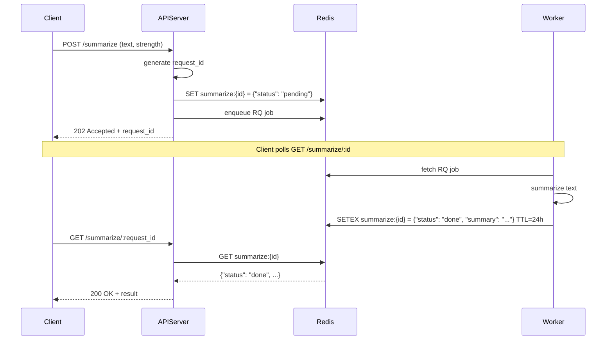

# Summarizer API

## Sequence

## API 概要

- 音声文字起こし結果 (`text`) に対して要約処理を非同期で実行
- クライアントは `POST /summarize` で文字起こしテキストと強度（summary strength）を送信
  - `strength` は 1〜5 の整数（小さいほど短く、5で最長）
- `request_id` が返却され、クライアントは `GET /summarize/{request_id}` で結果を取得

---

## API エンドポイント仕様

see. api-spec.json

### POST /summarize

#### 入力

- `application/json`
- パラメータ:
  - `text`: 文字起こし全文
  - `strength`: 要約の強度 1 - 5

#### レスポンス

- `202 Accepted`: `{ "request_id": "01HZX..." }`
- `400 Bad Request`: `{ "error": "invalid input" }`
- `500 Internal Server Error`: `{ "error": "internal server error" }`

---

### GET /summarize/:request_id

#### レスポンス

- `200 OK` + 結果 : `{ "status": "done", "summary": "...", "expires_at": "" }`
- `200 OK` + 待機中: `{ "status": "pending" }`
- `200 OK` + 進行中 : `{ "status": "working" }`
- `200 OK` + 失敗 : `{ "status": "error", "error": "..." }`
- `404 Not Found`: `{ "error": "request not found" }`
- `500 Internal Server Error`: `{ "error": "internal server error" }`

---

## その他

- 要約結果は成功失敗にかかわらず，処理終了から 24 時間で削除
- `expires_at` が ISO8601 形式で返却されるので，クライアント側で適切に処理する
