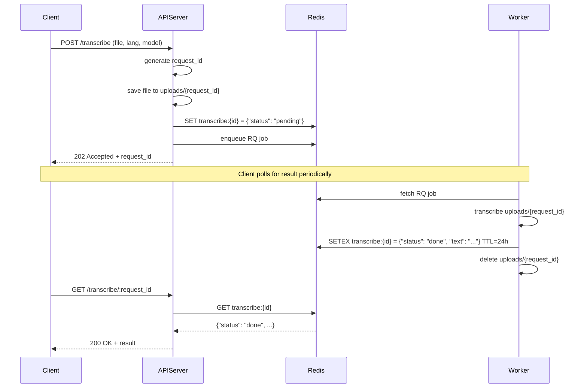

# Transcriber API

---

## Sequence

---

## API エンドポイント仕様

see. api-spec.json

### POST /transcribe

#### 入力

- `multipart/form-data`:
  - `file`: `.wav` 音声ファイル

#### レスポンス

- `202 Accepted`: `{ "request_id": "<ulid>" }`
- `400 Bad Request`: `{ "error": "invalid file" }`
- `500 Internal Server Error`: `{ "error": "internal server error" }`

---

### GET /transcribe/:request_id

#### レスポンス

- `200 OK` + 結果: `{ "status": "done", "text": "...", "expires_at": "ISO8601" }`
- `200 OK` + 進行中: `{ "status": "working" }`
- `200 OK` + 失敗: `{ "status": "error", "error": "reason" }`
- `404 Not Found`: `{ "error": "request not found" }`
- `400 Bad Request`: `{ "error": "bad request" }`
- `500 Internal Server Error`: `{ "error": "internal server error" }`

---

## アップロードの制約

- ファイル形式: `.wav` のみ対応（形式変換はクライアント側で行う）
- ファイルサイズ制限: 最大 1 GiB（約 1073741824 バイト）
- 不正な形式・サイズは `400 Bad Request` でエラーメッセージを返す

## その他

- 文字起こしの結果は成功失敗にかかわらず，処理終了から24時間で削除
- `expires_at` が ISO8601 形式で返却されるので，クライアント側で適切に処理する
- アップロードされたファイルは処理終了時に削除
- 失敗や中断により残ったディレクトリは24時間周期のバッチで削除
  - request_id と紐づかないディレクトリが対象
